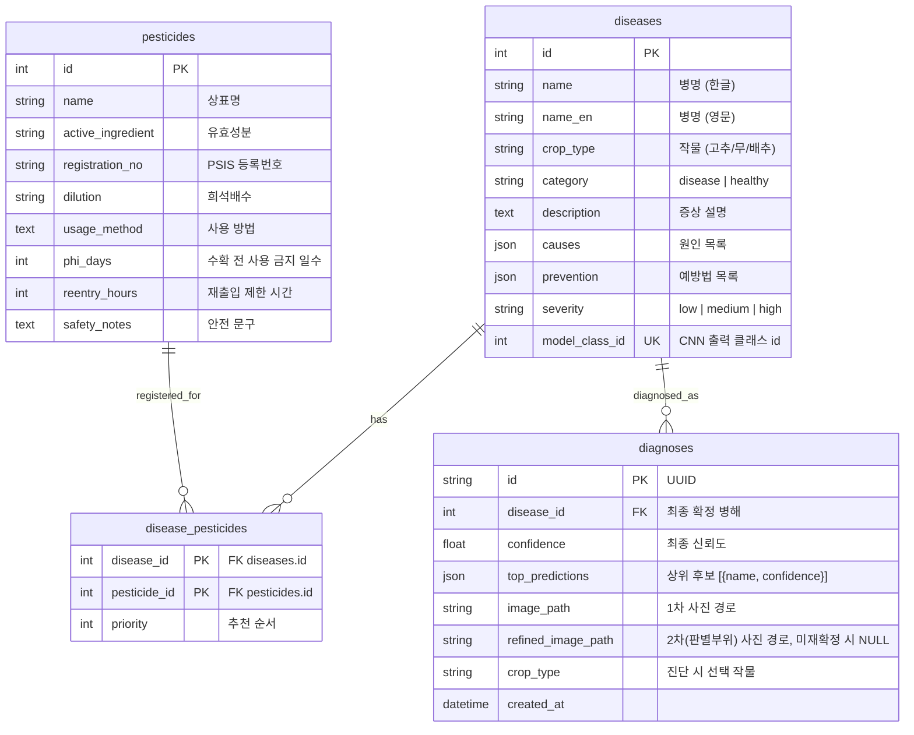
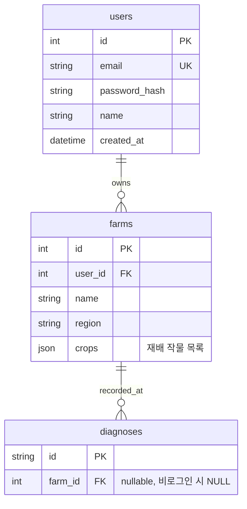

# ERD — CropCare AI

> 과목: 모바일시스템응용프로젝트 · 팀명: 크래파스 · 작성일: 2026-09-08 · 상태: v0.1
> 기준: `backend/app/models/entities.py` (SQLAlchemy, SQLite). 웹앱 단계는 아래 4개 테이블로 운영하고, 회원·농장(Phase 2)은 별도 다이어그램으로 표시.

---

## 1. 다이어그램 (웹앱 단계)

## 2. Phase 2 확장 (F9 사용자 인증·농장별 이력, 웹앱 단계 미구현)

---

## 3. 테이블 설명

| 테이블 | 역할 | 데이터 출처 | 쓰기 주체 |
|---|---|---|---|
| diseases | 모델이 분류하는 9개 클래스(병해 8 + 정상)의 정보 | 시드 파일 (backend/app/data/seed) | 시드 스크립트 (BE), 클래스 정의는 ML |
| pesticides | 등록 농약 정보 | PSIS OpenAPI 동기화 (sync_pesticides.py) | 동기화 스크립트 (BE) |
| disease_pesticides | 병해별 추천 농약 매핑과 우선순위 | 시드 + PSIS 적용 대상 | 동기화 스크립트 (BE) |
| diagnoses | 사용자 진단 기록 (자동 저장) | 런타임 | POST /diagnose, POST /diagnose/{id}/refine |

---

## 4. 관계와 제약

- diseases.model_class_id는 CNN 출력 인덱스와 1:1이며 unique. 모델 클래스가 바뀌면(F10 확장) ML이 새 표를 주고 BE가 시드를 갱신한다.
- disease_pesticides는 다대다 연결 테이블. 한 농약이 여러 병해에 등록될 수 있고, priority로 결과 화면 노출 순서를 정한다.
- diagnoses.disease_id는 재확정 후 **최종** 병해를 가리킨다. 1차 결과는 top_predictions에 그대로 남고, 재확정 여부는 refined_image_path가 NULL인지로 판별한다.
- diagnoses.id는 UUID 문자열. 이력 URL(/history/{id})에 그대로 노출되므로 순차 정수를 쓰지 않는다.
- 이미지 파일은 DB에 넣지 않고 backend/uploads/에 저장하며 경로만 기록한다. 응답 시 image_url로 변환한다.
- 웹앱 단계에는 사용자 개념이 없어 diagnoses에 소유자 컬럼이 없다. 단말 하나 또는 브라우저 하나가 하나의 이력 공간이다.

---

## 5. 화면 ↔ 테이블 매핑

| 화면 | 읽는 테이블 | 쓰는 테이블 |
|---|---|---|
| M-01 홈 | — | — |
| M-02 → M-04 진단 | diseases, pesticides, disease_pesticides | diagnoses (insert) |
| M-05 → M-06 재확정 | 동일 | diagnoses (update: disease_id, confidence, top_predictions, refined_image_path) |
| M-07 이력 목록 | diagnoses ⋈ diseases | — |
| M-08 이력 상세 | diagnoses ⋈ diseases ⋈ pesticides | — |

---

## 6. 오렌지파이 단계 참고

- 단말은 동일 스키마의 SQLite를 로컬에 두고 오프라인으로 동작한다. 서버 동기화는 범위 밖.
- 음성 로그(STT 인식 텍스트, 발화 문장)를 남길 경우 voice_logs(id, diagnosis_id FK, kind, text, created_at) 추가를 검토한다.
